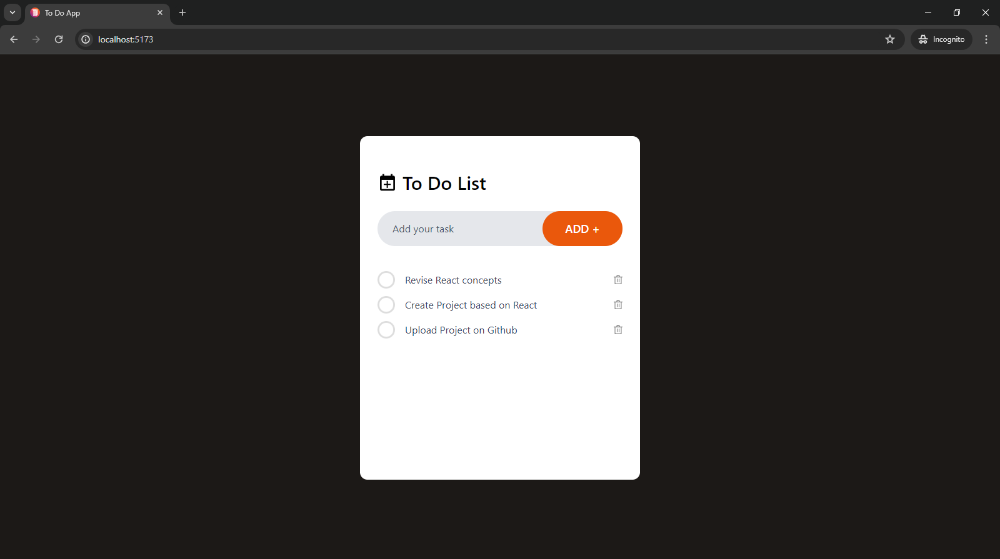

# To Do List

## Description

To Do List is a simple, user-friendly task management application built with React and Tailwind CSS. It allows users to add, edit, delete, and mark tasks as completed, helping them organize their daily activities efficiently.

## Features

- **Add Tasks**: Quickly add new tasks to your list.
- **Mark as Completed**: Mark tasks as completed to keep track of your progress.
- **Delete Tasks**: Remove tasks that are no longer needed.
- **Responsive Design**: Optimized for both desktop and mobile devices using Tailwind CSS.

## Screenshots

### Initial View


### Adding Tasks


### Completed Tasks


*(Ensure the paths to the images are correct relative to the README file location)*

## Getting Started

### Prerequisites

- Node.js (v14.x or later)
- npm (v6.x or later) or yarn (v1.x or later)

### Installation

1. Clone the repository:
    \```sh
    git clone https://github.com/kaustubh-01/todo-list.git
    cd todo-list
    \```

2. Install dependencies:
    \```sh
    npm install
    \```
    or
    \```sh
    yarn install
    \```

### Running the Application

To start the development server, run:
\```sh
npm start
\```
or
\```sh
yarn start
\```
The application will be available at `http://localhost:3000`.

### Building for Production

To create a production build, run:
\```sh
npm run build
\```
or
\```sh
yarn build
\```
The build output will be in the `build` directory.

## Usage

1. Open the application in your browser.
2. Use the input field to add new tasks.
3. Click the checkbox to mark tasks as completed.
4. Use the delete button to remove tasks.


## Technologies Used

- **React**: JavaScript library for building user interfaces.
- **Tailwind CSS**: Utility-first CSS framework for rapid UI development.
- **React Icons**: Collection of popular icons for React.

## Contributing

Contributions are welcome! Please open an issue or submit a pull request for any changes.

### Steps to Contribute

1. Fork the repository.
2. Create a new branch (`git checkout -b feature/your-feature-name`).
3. Make your changes.
4. Commit your changes (`git commit -m 'Add some feature'`).
5. Push to the branch (`git push origin feature/your-feature-name`).
6. Open a pull request.

## Contact

- **Author**: Kaustubh Salegaonkar
- **Email**: kaustubh.salegaonkar@gmail.com
- **GitHub**: [kaustubh-01](https://github.com/kaustubh-01)
